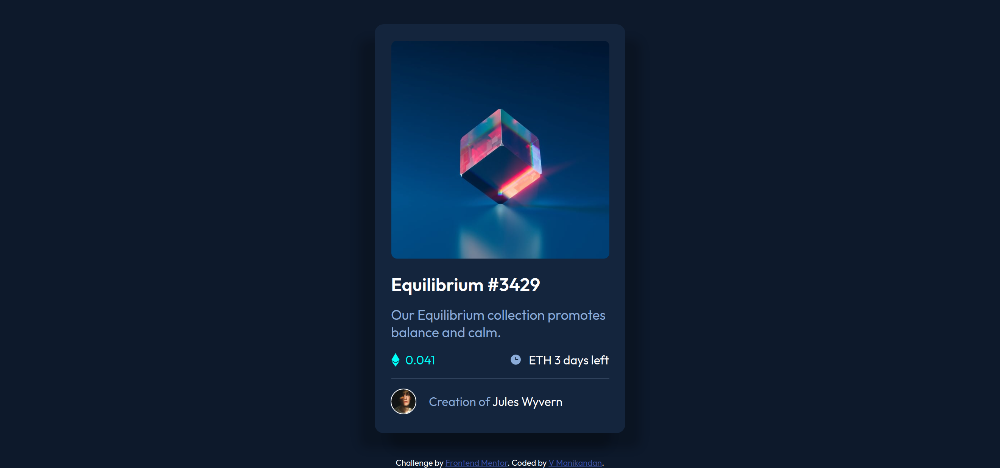

# Frontend Mentor - NFT preview card component solution

This is a solution to the [NFT preview card component challenge on Frontend Mentor](https://www.frontendmentor.io/challenges/nft-preview-card-component-SbdUL_w0U). Frontend Mentor challenges help you improve your coding skills by building realistic projects.

## Table of contents

-   [Overview](#overview)
    -   [The challenge](#the-challenge)
    -   [Screenshot](#screenshot)
    -   [Links](#links)

## Overview

### The challenge

-   View the optimal layout depending on their device's screen size
-   See hover states for interactive elements

### Screenshot

### Links

-   Solution URL: [Add solution URL here](https://github.com/mani-cmd/nft-preview-card-component)
-   Live Site URL: [Add live site URL here](https://your-live-site-url.com)
